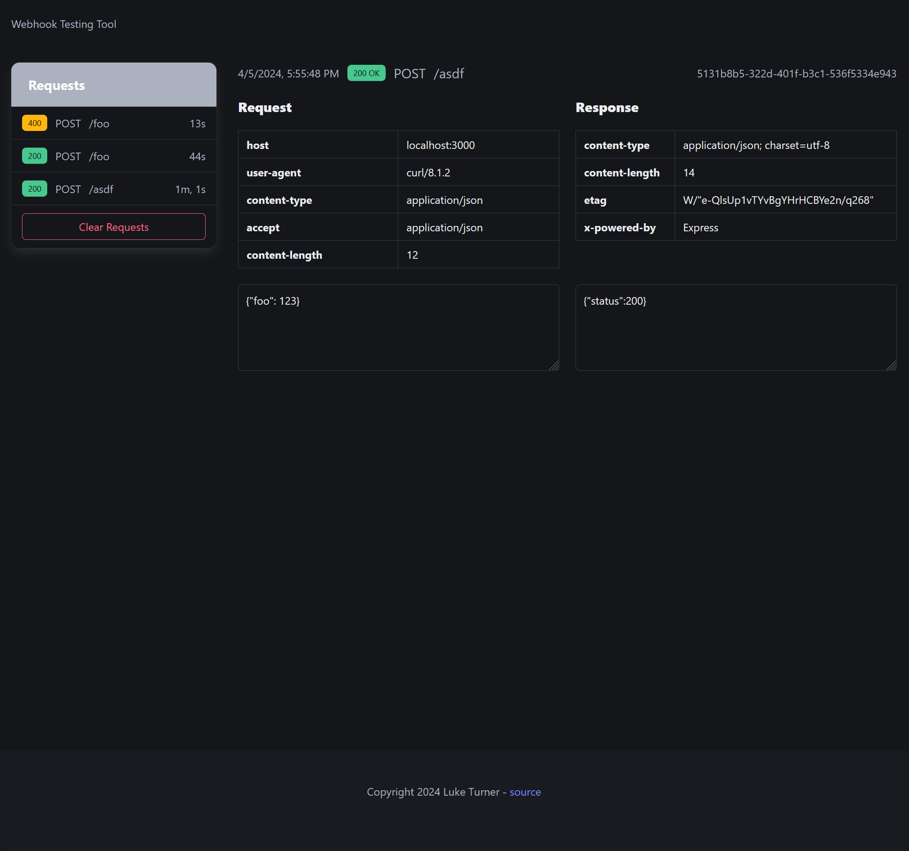
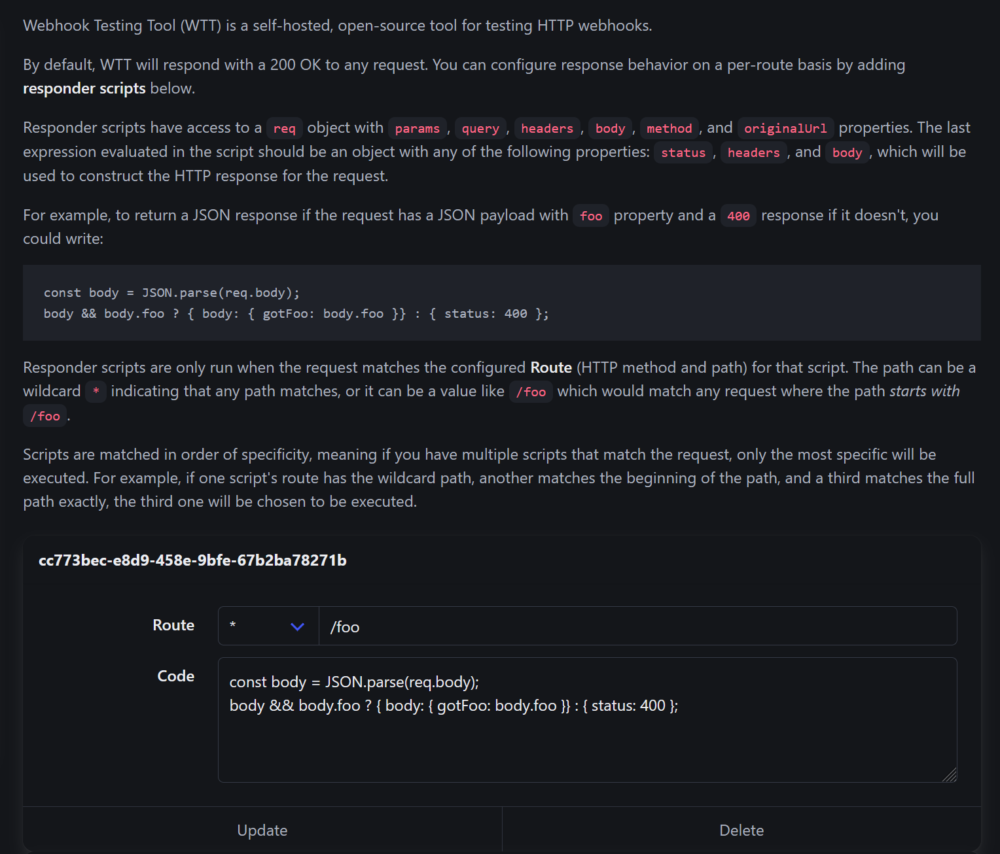

# Webhook Testing Tool (wtt)

`wtt` is an open-source, self-hosted alternative to webhook testing tools like https://webhook.site.



How it works:

1. You deploy a copy of `wtt` for your personal use.
   - Designed for easy deployment on [Fly](https://fly.io), where it would cost between $0 to $3 per month depending on usage. But should work with any cloud provider.
2. You make arbitrary HTTP requests to your `wtt` instance, with any method and URL, and it returns a 200 OK response.
   - (optional) You write _responder scripts_ to configure how `wtt` responds to requests.
3. The full headers, raw payloads, etc. for all requests and responses are stored in a SQLite database.
4. You visit the special `/__admin` URL in your browser to open a (password-protected) UI to view the requests and responses.

## Responder scripts

One special feature is the ability to configure how `wtt` responds to requests. This is available in the admin UI:




## Local testing

Requirements:

- [Bun](https://bun.sh/)

```bash
# install dependencies
bun install

# create local folder for db
mkdir local

# run the server
bun run dev
```

View the UI at http://localhost:3000/__admin (login with user `admin` / password `admin` for local development)

## Deployment

`wtt` is designed for deployment on [Fly](https://fly.io):

```bash
flyctl launch --no-deploy
flyctl secrets set WTT_ADMIN_PASSWORD=yoursecretpassword
flyctl volumes create -s 1 -r sea data 
flyctl deploy
```

