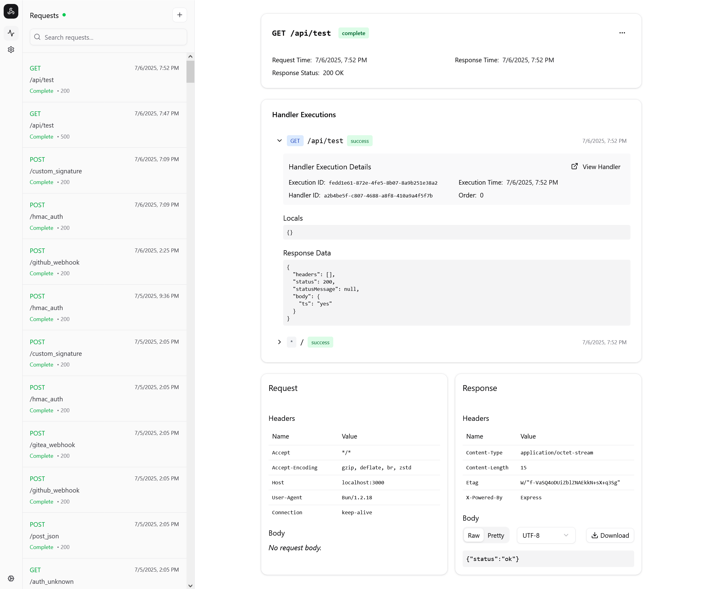
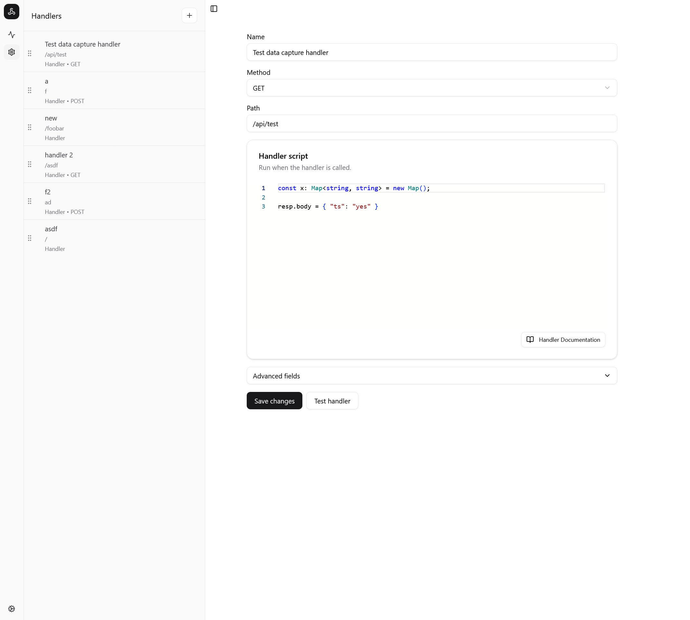

# Webhook Testing Tool (wtt)

> [!NOTE]
> This README is for `v2` of webhook-testing-tool.
>
> The README and code for `v1` are available at: https://github.com/luketurner/webhook-testing-tool/releases/tag/v1.

`wtt` is an open-source alternative to webhook testing tools like https://webhook.site. It's designed for easy and lightweight self-hosting.



How it works:

1. You deploy a copy of `wtt` for your personal use.
   - Designed for easy deployment on [Fly](https://fly.io), where it would cost between $0 to $3 per month depending on usage. But should work with any cloud provider.
2. You make arbitrary HTTP requests to your `wtt` instance, with any method and URL, and it returns a 200 OK response.
   - (optional) You write _handlers_ to configure how `wtt` responds to requests.
3. The full headers, raw payloads, etc. for all requests and responses are stored in a SQLite database.
4. You visit the admin URL in your browser to open a (password-protected) UI to view the requests and responses.

## Features

- Easy to deploy; runs in a single container.
- Automatically responds to any HTTP request.
- Response behavior can be customized with Typescript code by defining **handlers**. See the Handlers section below.
- TLS termination with self-signed certificate or automatic Let's Encrypt certificates via ACME (work in progress, TLS socket info not currently available in Bun. See [related issue](https://github.com/oven-sh/bun/issues/16834))
- JWT parsing and signature verification against a JWKS or JWK URL.
- Formatting and syntax highlighting for JSON request/response bodies.
- Viewing request/response bodies in multiple encodings including UTF8, Latin-1, base64, hex, and binary.
- Special "parsed" views for certain common types of bodies, like JSON, XML/HTML, `application/x-www-form-urlencoded`, and `multipart/form-data`.
- Downloading request/response bodies as files, with extensions guessed based on the `Content-Type` header.
- `Authorization` header inspector that parses Basic, Bearer, JWT, and HMAC authorization schemes.
- Parse and verify `X-Signature-*` headers as sent by e.g. Github/Gitlab/etc.
- Composing and sending test requests directly from the UI.
- Datetime inspector that displays timestamps in multiple formats and timezones.
- Copy requests as cURL or Fetch.
- Share requests (generates a public URL that anyone can use to see a read-only view of the request and response).

## Limitations

- Does not support multi-user login. (Users are expected to deploy their own instance of `wtt` instead of sharing.)
- Reliance on SQLite means horizontal scaling is tricky. I recommend running `wtt` with a single pod/container and SQLite stored in a persistent volume. You could probably make horizontal scaling work with [Litestream](https://litestream.io/) or something, but I haven't tried it.

## Handlers

One special feature is the ability to configure how `wtt` responds to requests using handlers.



Handlers are written in Typescript and can be edited in the `wtt` admin UI. You can define multiple scripts based on the request's HTTP method and URL. Handlers can be nested with an Express-style middleware pattern as well. Some notable features:

- Multiple handlers can be executed for a single request in a kind of middleware pattern. Nested handlers can share state using a `locals` value.
- Handlers can match on paths with parameters in an Express style e.g. `/person/:id`
- Handlers can share state with all other handlers **globally** using the `shared` object. This is stored in the DB and persists across server restarts.
- Use `resp.body_raw` to return a base64 encoded payload that can include arbitrary content.

Documentation about handlers is available in the in-app manual, or you can open [the manual page](./src/docs/handlers.md) in Github.

## Local testing

Requirements:

- [Bun](https://bun.sh/)

```bash
# install dependencies
bun install

# create local folder for db
mkdir local

# run the server
bun run dev

# run automated tests
bun run test
```

View the UI at http://localhost:3001/ (login with user `admin@example.com` / password `admin123` for local development)

## Development with Claude Code

This project is designed to be developed in tandem with Claude Code using the following steps:

1. Open the project in a Devcontainer.
2. When starting on a new feature, run `wt new` to create a new worktree and launch a zellij session for that worktree with:
   - Claude Code
   - Dedicated app server for testing changes in that worktree
   - Lazygit for seeing what changes were made.
3. Once finished working in that worktree, exit Zellij with `C-b q` and you will be prompted to cherry-pick the commits from the worktree into the `main` branch.

## Deployment

`wtt` is designed for deployment on [Fly](https://fly.io):

```bash
flyctl launch --no-deploy
flyctl secrets set WTT_ADMIN_USERNAME=you@example.com WTT_ADMIN_PASSWORD=yoursecretpassword BETTER_AUTH_SECRET="$(openssl rand -base64 32)"
flyctl volumes create -s 1 -r sea data
flyctl deploy
```

Then you can open the admin dashboard at `https://$APP_NAME.fly.dev:8000/`, and send webhook requests to `http://$APP_NAME.fly.dev` or `https://$APP_NAME.fly.dev`

## SSL/TLS Configuration

`wtt` supports HTTPS connections with two certificate options:

### Self-Signed Certificates (Default)

By default, `wtt` uses self-signed certificates located in the `certs/` directory. To enable HTTPS:

```bash
# Generate certificates (if not already present)
./certs/generate-cert.sh

# Set environment variables
export WTT_WEBHOOK_SSL_ENABLED=true
export WTT_WEBHOOK_SSL_PORT=3443  # Default HTTPS port
```

### Let's Encrypt Certificates (ACME)

> [!WARNING]
> ACME support is still a work in progress!


For production deployments, `wtt` can automatically obtain and renew certificates from Let's Encrypt:

```bash
# Enable ACME
export WTT_ACME_ENABLED=true
export WTT_WEBHOOK_SSL_ENABLED=true

# Configure your domain(s)
export WTT_ACME_DOMAINS=example.com,www.example.com
export WTT_ACME_EMAIL=admin@example.com

# Optional: Use Let's Encrypt staging for testing
export WTT_ACME_STAGING=true
```

**ACME Requirements:**
- Your domain must point to your `wtt` instance
- Port 80 must be accessible for HTTP-01 challenges
- Certificates are stored in `local/acme-certs/` and persist across restarts
- Certificates are automatically renewed 30 days before expiration

**ACME Environment Variables:**
- `WTT_ACME_ENABLED`: Enable ACME certificate provisioning
- `WTT_ACME_DOMAINS`: Comma-separated list of domains
- `WTT_ACME_EMAIL`: Contact email for Let's Encrypt
- `WTT_ACME_STAGING`: Use Let's Encrypt staging environment (for testing)
- `WTT_ACME_DIRECTORY`: Custom ACME directory URL (defaults to Let's Encrypt production)
- `WTT_ACME_CERT_PATH`: Certificate storage path (defaults to `local/acme-certs`)